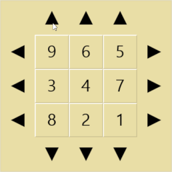

# numeric-grid-puzzle
An implementation of the Sixteen puzzle with hints

Online demo: https://numeric-grid-puzzle.appspot.com/

## Background
The Sixteen puzzle challenges the user to sort a grid of numbered tiles. Unlike the Fifteen puzzle there isn't an empty space. Each move will shift an entire row or column. Every move shifts a tile outside of the puzzle grid and it reappears on the other side of the corresponding row or column.

What makes this implementation special is that hints are available for puzzles up to size 3x3.

## Quick Start Guide
To get this Flask site running locally:

0. Make sure you have Python 3.7 available and clone the repository.
1. While optional, it is highly recommended to create your virtual environment, and activate it as described [here](https://docs.python.org/3.7/library/venv.html).
2. Use pip to install all requirements in requirements.txt: `pip install -r requirements.txt`
3. Tests may be run with the command: `python -m unittest`
4. To launch: `python routes.py`
